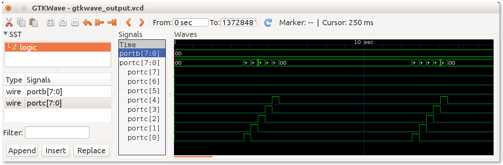

# giri-fu

`giri-fu` is a simple garden irrigator functional unit, running on a single chip, micro controller unit.

This repository holds the firmware of this unit,
and it is written for the [giri-fu-hw](https://github.com/tombenke/giri-fu-hw/tree/v1.0.0) hardware unit.

The picture below shows [the logical functional block diagram of the v1.0 unit](docs/giri_fu_v1.0_FBD.png?raw=true):

## Features

- Direct, preprogrammed control of max 6 valves with built-in start-and-stop timers.
- Repeats the same timing pattern every 24 hours.
- Timing starts after reset, with a preprogrammed time offset (no built-in RTC support).

## Infrastructure: [giri-fu-hw v1.0](https://github.com/tombenke/giri-fu-hw/tree/v1.0.0)

## Platform

### Language/runtime

- C
- AVR lib

### Tools

In order to use the project, you need the software and hardware tools listed below.

#### Hardware tool
- AVRISPmkII programmer

#### Software tools
- make
- gcc
- avr-gcc
- avrdude

#### Optional for simulation
- simavr
- libdrm
- libelf
- GTKWave

## Artifacts

- The `src/firmware` holds the firmware.
- The `src/simulator` holds a tiny simulation environment of the hardware board, for development and testing purposes.
- The `dist` folder contains the hex file and the simulator binary, after executing the build command.

### Build

Before you build the binaries, first select the target CPU and set the required clock frequency,
by defining the appropriate variables in the first section of the Makefile:

    # Select the target MCU, by uncommenting the appropriate lines below
    # ATtiny25
    #export MMCU=attiny25
    #export PARTNO=t25

    # ATtiny2313
    #export MMCU=attiny2313
    #export PARTNO=t2313

    # ATmega168
    export MMCU=atmega168
    export PARTNO=m168

    # ATmega328P
    #export MMCU=atmega328
    #export PARTNO=m328p

    # Set the clock frequency for CPU
    export F_CPU=4000000

In order to build the run the Makefile from the project root folder:

    make all

This will build the binaries and the hex file into the `dist` folder:

    $ tree
    .
    ├── dist
    │   ├── firmware.axf
    │   ├── firmware.hex
    │   └── simulator

### Run simulation

Step into the `dist` directory, and run the `simulator` with the `firmware.axf` binary:

    cd dist
    ./simulator firmware.axf

    Firmware pathname is firmware.axf
    Loaded 668 .text at address 0x0
    Loaded 74 .data
    firmware firmware.axf f=4000000 mmcu=atmega168
    Starting VCD trace
    ^C

The simulation runs in an infinite loop, so stop it after a couple of second by pressing the `CTRL-C` keys.

The results of the simulation will be stored into the `gtkwave_output.vcd`, which can be displayed with the GTKWave utility,
as the next screenshot demonstrates:

On the screenshot, you can see the individual bits of the `PORTB` are switched on/off in series after one another.

### Burn the firmware

In order to burn the hex file onto the MCU,
connect the burner adapter to the computer,
and plug into the ISP connector on the MCU board, then execute the following command:

    make burn

## Usage

- Program the start-stop timing, and RTC offset time for reset.
- Build the binaries and the hex file.
- Burn the hex file onto the hardware module.
- Start control period with power-on.

## References

- [giri-fu-hw v1.0 project](https://github.com/tombenke/giri-fu-hw/tree/v1.0.0)
- [AVR Libc Home Page](http://www.nongnu.org/avr-libc/)
- [GTKWave home](http://gtkwave.sourceforge.net/)
- [simavr - a lean and mean Atmel AVR simulator for linux](https://github.com/buserror/simavr)
- [freedreno/libdrm](freedreno/libdrm)
- [libelf package in Ubuntu](libelf package in Ubuntu)
